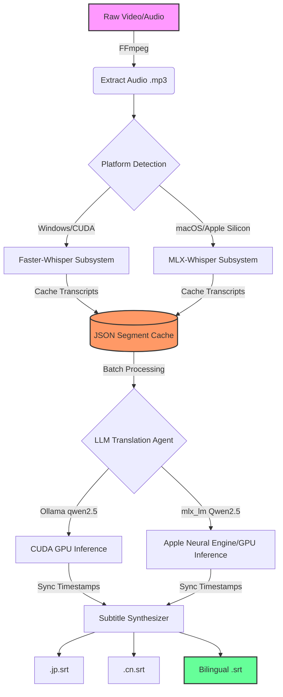

# Weekend Project: Nihongo-SRT: AI Japanese Learner's Subtitle Pipeline

An end-to-end multi-platform AI pipeline that extracts Japanese audio from videos, transcribes native speech, translates it to Traditional Chinese using local open-weight large language models, and generates dual-language bilingual subtitles.

This repository was purpose-built to **facilitate Japanese language learning** by creating high-quality, synchronized bilingual subtitles (Japanese + Chinese) for raw anime, dramas, or learning materials.

## 🚀 Architecture for MLOps & DevOps



This pipeline is designed with **MLOps best practices** in mind, offering resilience, observability, and infrastructure-as-code capabilities.

*   **Dual-Platform Support**: Features discrete pipelines built for Nvidia CUDA (`pipeline_cuda.py`) using `faster-whisper` and Ollama, and Apple Silicon (`pipeline_mlx.py`) using Apple's MLX engine for optimized inference.
*   **Pipeline Resilience**: Implements JSON-based checkpointing between the Transcription (Whisper) and Translation (LLM) agents. If the system crashes or halts, the pipeline resumes execution identically without wasting compute or re-running inferences.
*   **Observability**: Integrated standard structured logging ensuring that execution progress, errors, and system states are monitored and formatted cleanly.
*   **Infrastructure-as-Code**: Includes an Ansible `playbook.yml` to programmatically provision the local environment and a `Dockerfile` to containerize the CUDA inference dependencies. 

## 🛠 Prerequisites

*   **System Dependencies**: FFmpeg must be installed and in your system PATH.
*   **Python**: Python 3.10+ isolated in a virtual environment.
*   **LLM Backend**: 
    *   *Windows/Linux*: [Ollama](https://ollama.com/) must be installed and running. Pull the required models (`ollama pull qwen2.5:7b-instruct`).
    *   *macOS*: Models are loaded dynamically via Hugging Face using `mlx_lm`.

## 📦 Setup & Installation

1.  **Clone the Repository**:
    ```bash
    git clone <your-repo-url>
    cd llm_srt
    ```
2.  **Environment Variables**:
    Copy the sample configuration file and customize it.
    ```bash
    cp .env.example .env
    ```
3.  **Install Python Requirements**:
    ```bash
    python3 -m venv venv
    source venv/bin/activate  # On Windows: venv\Scripts\activate
    pip install -r requirements.txt
    ```

### Alternatively: Provision via Ansible
```bash
ansible-playbook playbook.yml
```

### Alternatively: Run via Docker (CUDA Only)
```bash
docker build -t generative_translator .
docker run --gpus all -v /path/to/local/media:/data generative_translator --input /data/video.mp4 --output-dir /data/output
```

## 🧠 Usage

Run the pipeline targeting either a `.mp4` video or `.mp3` audio file.

**For NVIDIA CUDA Machines:**
```bash
python pipeline_cuda.py --input sample_video.mp4 --output-dir ./results
```

**For Apple Silicon (M-Series) Machines:**
```bash
python pipeline_mlx.py --input sample_video.mp4 --output-dir ./results
```

## ⚙️ How It Works (Pipeline Overview)

1.  **Extraction**: Audio is stripped from the video using lightweight FFmpeg pass to save I/O overhead.
2.  **Transcription (Agent 1)**: The Whisper speech-to-text model generates raw, natively timed Japanese text segments. Output is cached securely to disk.
3.  **Translation (Agent 2)**: The Qwen language model receives batched queries translating the Japanese to Traditional Chinese. Utilizing batches minimizes sequence overhead. Output is continuously checkpointed.
4.  **Generation**: Synchronized dual-language `.srt` files are synthesized and saved to the target directory.
