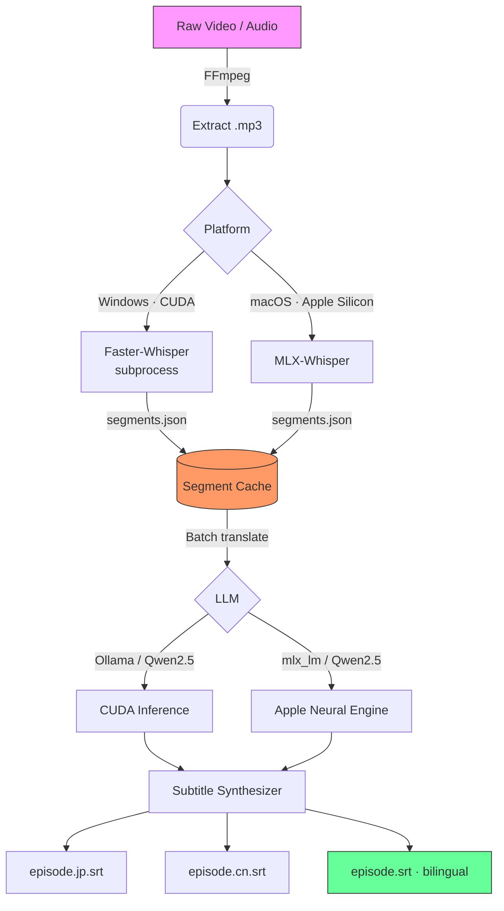

# Nihongo-SRT: AI Japanese Subtitle Pipeline

An end-to-end, multi-platform AI pipeline that extracts Japanese audio from video, transcribes native speech with Whisper, translates to Traditional Chinese with a local LLM, and generates synchronized bilingual `.srt` subtitle files.

Built as a Japanese language learning tool — and as a hands-on playground for **LangGraph**, **MLX**, and **local LLM inference**.

---

## 🏗 Architecture



---

## 📁 Repository Layout

| File                         | Description                                                                             |
| ---------------------------- | --------------------------------------------------------------------------------------- |
| `nodes.py`                   | **Shared LangGraph node definitions** — `PipelineState`, all 4 nodes, backend injection |
| `pipeline_langgraph_cuda.py` | ⭐ **LangGraph entrypoint (CUDA/Windows)** — Whisper in subprocess, Ollama translate     |
| `pipeline_langgraph_mlx.py`  | ⭐ **LangGraph entrypoint (MLX/macOS)** — MLX Whisper + Qwen2.5 translate                |
| `pipeline_cuda.py`           | Legacy CUDA pipeline (single-script, no LangGraph)                                      |
| `pipeline_mlx.py`            | Legacy MLX pipeline (single-script, no LangGraph)                                       |
| `requirements.txt`           | Python dependencies                                                                     |
| `.env.example`               | Environment variable template                                                           |
| `playbook.yml`               | Ansible provisioning playbook                                                           |
| `Dockerfile`                 | Docker image for CUDA inference                                                         |

> **Recommended**: Use the `pipeline_langgraph_*.py` entrypoints — they are more resilient and support retry logic.

---

## 🔄 LangGraph Pipeline

The LangGraph pipeline represents the nodes as a linear `StateGraph`:

```
__start__
    ↓
extract_audio   ← FFmpeg; skips if .mp3 already exists
    ↓
transcribe      ← Whisper; skips if .segments.json cache valid
    ↓
translate       ← LLM batch translation; checkpoints per batch
    ↓
write_srt       ← Writes .jp.srt / .cn.srt / bilingual .srt
    ↓
__end__
```

**Key design decisions:**

- **Whisper runs in a subprocess** (CUDA only) — when the process exits, the OS frees all VRAM cleanly. This completely avoids the CTranslate2 destructor crash that occurs when Ollama holds a concurrent CUDA context.
- **Segment cache is written atomically** inside the Whisper function — a crash between Whisper and translation no longer loses the transcript.
- **Recursive batch-halving retry** — on an Ollama batch mismatch, the failing batch is split in half and retried recursively (O(log n)) before falling back to single-line translation.
- **LangGraph `RetryPolicy`** on the translate node — handles Ollama HTTP connection drops automatically (up to 3 retries with backoff).

---

## 🛠 Prerequisites

| Dependency                                  | Purpose                           |
| ------------------------------------------- | --------------------------------- |
| [FFmpeg](https://ffmpeg.org/)               | Audio extraction                  |
| Python 3.10+                                | Runtime                           |
| [Ollama](https://ollama.com/) *(CUDA only)* | LLM inference server              |
| NVIDIA GPU *(CUDA only)*                    | Faster-Whisper + Ollama inference |
| Apple Silicon Mac *(MLX only)*              | MLX Whisper + Qwen2.5 inference   |

---

## 📦 Installation

```bash
git clone https://github.com/hwong5208/LLM_Benkyo_Nihongo_SRT.git
cd LLM_Benkyo_Nihongo_SRT

# Create virtualenv
python -m venv venv
source venv/bin/activate          # macOS/Linux
# venv\Scripts\activate           # Windows

pip install -r requirements.txt

# Copy and configure environment
cp .env.example .env
```

### Alternative: Provision via Ansible
```bash
ansible-playbook playbook.yml
```

### Alternative: Docker (CUDA only)
```bash
docker build -t nihongo-srt .
docker run --gpus all \
  -v /path/to/media:/data \
  nihongo-srt --input /data/video.mp4 --output-dir /data/output
```

---

## ⚙️ Configuration (`.env`)

```ini
# Shared
WORKSPACE_DIR=./workspace          # Scratch dir for audio + cache files

# CUDA / Windows
OLLAMA_API_URL=http://localhost:11434/api/generate
OLLAMA_MODEL=qwen2.5:7b-instruct
OLLAMA_BATCH_SIZE=25
WHISPER_MODEL_SIZE=medium
WHISPER_DEVICE=cuda
WHISPER_COMPUTE_TYPE=float16

# MLX / macOS
MLX_WHISPER_MODEL=mlx-community/whisper-large-v3-turbo
MLX_LLM_MODEL=mlx-community/Qwen2.5-7B-Instruct-4bit
MLX_BATCH_SIZE=20
```

---

## 🚀 Usage

**CUDA / Windows (LangGraph — recommended):**
```bash
# Make sure Ollama is running first
ollama serve
ollama pull qwen2.5:7b-instruct

python pipeline_langgraph_cuda.py --input video.mp4 --output-dir ./output
```

**MLX / macOS (LangGraph — recommended):**
```bash
python pipeline_langgraph_mlx.py --input video.mp4 --output-dir ./output
```

**Resume** — re-run the same command. The pipeline automatically skips completed stages:
- Audio already extracted → skip FFmpeg
- Segments cache exists and valid → skip Whisper
- Translation cache exists → skip already-translated batches

**Print graph topology only:**
```bash
python pipeline_langgraph_cuda.py --input video.mp4 --print-graph
```

---

## 📤 Output Files

For an input `episode01.mp4`, the pipeline produces:

| File               | Contents                        |
| ------------------ | ------------------------------- |
| `episode01.jp.srt` | Japanese-only subtitles         |
| `episode01.cn.srt` | Traditional Chinese subtitles   |
| `episode01.srt`    | Bilingual (JP + CN on each cue) |

---

## 🔬 How It Works

1. **Extract** — FFmpeg strips audio to 16kHz mono `.mp3` into `./workspace`.
2. **Transcribe** — Whisper generates natively-timed Japanese segments, saved as `.segments.json`.
3. **Translate** — Qwen2.5 receives batched Japanese lines and returns Traditional Chinese. Each batch is checkpointed to `.trans_cache.json` — safe to interrupt and resume.
4. **Synthesize** — Timestamps and translated text are assembled into `.srt` files.

---

## 📜 License

This project is for personal and educational use.
